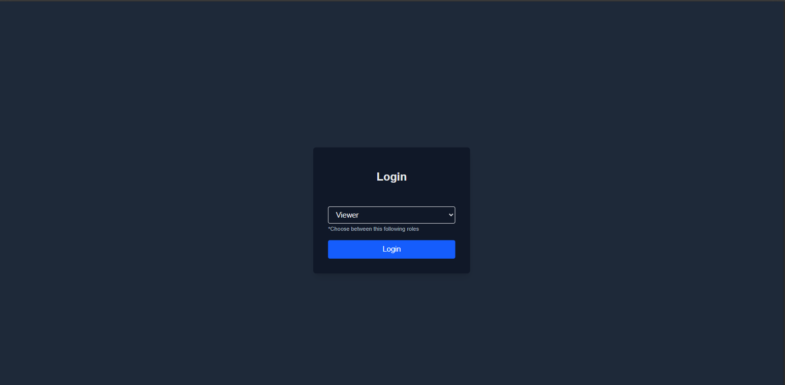
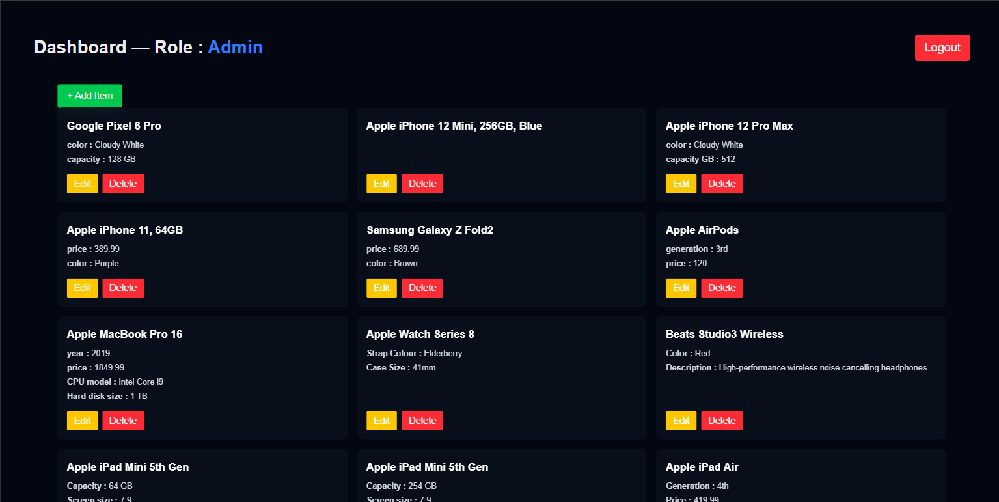

# 🚀 Role-Based Dashboard with CRUD — Next.js & Axios

A simple **Next.js** application demonstrating **Role-Based Access Control (RBAC)** and **CRUD** operations using a public API ([RESTful API](https://restful-api.dev/)).  
The app allows users to log in as different roles (Admin, Editor, Viewer) and access dashboard features based on permissions.

---

## 🧩 Features

- **Login screen** with role selection:
  - `Admin` — Add, Edit, Delete, View
  - `Editor` — Add, Edit, View
  - `Viewer` — View only
- **Dashboard**:
  - Fetch data from [RESTful API](https://restful-api.dev/) *note: stock data from this api cannot be edited or delete
  - Show/hide action buttons based on role
  - Add/Edit/Delete items (changes handled locally, API calls are for demonstration)
- **Error & Success Notifications** with auto-dismiss
- UI using **Tailwind CSS**

---

## 📸 Screenshots

---




## 🛠️ Tech Stack

- [Next.js 15 (App Router)](https://nextjs.org/)
- [React Hooks](https://react.dev/)
- [Axios](https://axios-http.com/)
- [Tailwind CSS](https://tailwindcss.com/)

---

## ⚙️ Installation & Setup

1. **Clone the repository**
   ```bash
   git clone https://github.com/RifkyHadi7/rbac-app.git
   cd rbac-app
2. **Install dependencies**
   ```bash
   npm install
3. **Run the development server**
   ```bash
   npm run dev
   ```
   Then open http://localhost:3000 in your browser.

## 🖥️ Usage

1. **Login**

- Select a role from the dropdown: Admin, Editor, or Viewer

- Click Login to go to the dashboard

2. **Dashboard**

- Data is fetched from the RESTful API

- Available actions depend on the role:

    | Role   | Add | Edit | Delete | View |
    | ------ | --- | ---- | ------ | ---- |
    | Admin  | ✅   | ✅    | ✅      | ✅    |
    | Editor | ❌   | ✅    | ✅      | ✅    |
    | Viewer | ❌   | ❌    | ❌      | ✅    |


